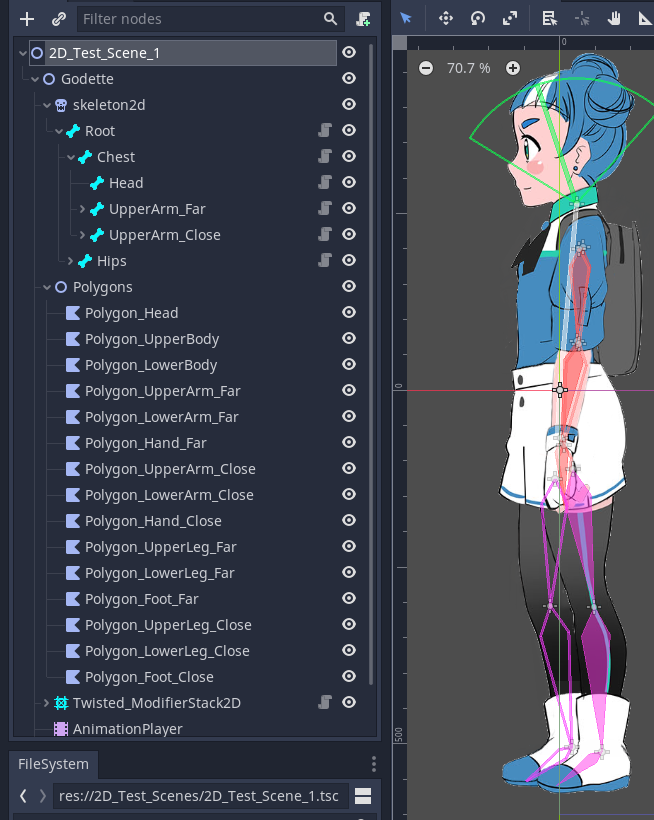

## Twisted IK 2 - How to Setup your 2D Skeleton for IK

This page will describe and show how to setup your 2D skeleton for IK. This will cover stuff to consider when setting up the node structure, as well as what IK modifiers you may want to use in certain situations.

#### Skeleton requirements

Unlike in 3D, the requirements for 2D are really simple! The setup is extremely similar to the setup for a normal Godot 2D Skeleton, so you can refer to the documentation if needed. The main difference is using Twisted_Bone2D nodes instead of Bone2D nodes. To summarize the setup needed:

You need have the sprite(s) or texture(s) for your character and have a Polygon2D node for each joint. Then, you need to make a Skeleton2D node and Twisted_Bone2D node in the scene with a scene tree that mirrors the bone setup. Here's an example image for Godette:

After you have created your bone setup, you then need to add a Twisted_SkeletonModifierStack2D node and then any IK modifiers you want to use. That's really about it! As you can see, its really easy to get started and get going.

There are, however, a few minor considerations and choices to consider:

* The first is whether you plan to scale the character by -1 on the X axis to flip horizontally. If this is the case, then you MUST have your Skeleton2D, IK modifiers, and any targets all as children of the same parent. Then you can flip this parent to flip the IK assembly correctly.
	* For example, in the image above you can see the node `Godette` contains the polygons, Skeleton2D and Twisted_Bone2D nodes, as well as the modifier stack.
	* This is a requirement to make negative scales work correctly when solving IK.
* If you want to use Sprite2D nodes or any other Node2D-based method to draw your character instead of Polygon2D, you can just make them children of the Twisted_Bone2D nodes that would rotate them!
	* For example, if you are using Sprite2D nodes you can just attach Sprite2D nodes to each limb node (Sprite for arm on the arm Twisted_Bone2D, etc)
* Tip bones, bones without any child Twisted_Bone2D nodes, will need to have their length and bone angle set manually. This can be done from the Godot node inspector.
* Twisted IK 2 bone nodes come with their own custom gizmo. To use it fully, you will want to disable the Godot-based Bone2D gizmo drawing. You can do so by pressing the little bone icon in the top bar of the scene view and un-checking the "Show Bones" checkbox.

#### Modifier Requirements

Just like in 3D, all 2D modifiers need to be children of a Twisted_ModifierStack2D node in order to work. You will need to point the Twisted_ModifierStack2D node to the Skeleton2D you are using, but that's about it! Then you can add any of the Twisted 2D modifiers as child nodes and setup them up.

IK modifiers in 2D are processed in order, from the first child to the last child. Here's an example showing what I mean:

* Twisted_ModifierStack2D
	* Twisted_ModifierFABRIK2D (will be processed first!)
	* Twisted_ModifierLookAt2D
	* Twisted_ModifierFABRIK2D (will be processed last!)

The order is important if you are using a full body IK setup, as you want IK modifiers that affect other IK modifiers to run first (like the spine before the arms). You can always change the order by rearranging the nodes in the scene, saving, and then reloading the scene. The order is saved internally when the scene is loaded for optimization purposes, so a scene open and close is required to update the stack.

#### What IK modifiers to use when

This is a large topic and ultimately it depends on your project, but there are some general recommendations I can make, especially for 2D:

For heads and anything that only needs to look at something, the LookAt modifier is ideal. In 2D you have angle constraints, which makes it really suitable for character heads when you want them to look at a target.
* An example use case would be using LookAt for the head of a simple shooter game, where you have the player character look at the mouse so it looks like the character is looking at where they are aiming.

For arms and legs, you have several choices. I will mention several choices, but if you have humanoid arms/legs composed of an upper limb and lower limb, I would highly recommend using TwoBoneIK. TwoBoneIK uses the law of cosigns to find the angles needed to reach the target. Its stable, gives nice results, and is performance friendly. It only works on 2 bones though, and does not support joint constraints (*currently at least*), but for most cases it is the IK modifier I would recommend for 2D arms and legs.
* An example use case is for the arms of a humanoid character. For example, you could use TwoBoneIK on the arms of a character in a simple shooter so it always appears to be holding a weapon.

One of the most popular is using FABRIK, which is a iterative IK solver that is very flexible and works with many joints. This is great if you are trying to use IK for things like a creature's limbs, which may not be composed of just 2 bones like a humanoid. Additionally, FABRIK works great for tails and wings, as it can support as many bones as you throw at it.
However, FABRIK is an iterative solver, and this means it has to run the computation several times to get to the target. This makes it more performance heavy than something like TwoBoneIK.
Additionally, without any tweaking the results can look unnatural for limbs. What you likely will want to do is configure the gravity options per joint so when it contracts, it bends in a expected way.
* You have two options for FABRIK in 2D, normal FABRIK and a constrained FABRIK. Constrained FABRIK gives you angle constraints you can set, but this means it sometimes cannot reach the target and is more performance heavy. Additionally, the implementation for angle constraints in 2D FABRIK currently are not quite perfect, though they are usable.
	* On a whole, I would recommend seeing if you can use gravity options per joint to get nice looking results and then limit the target node's position to acceptable bounds rather than relying on constrained FABRIK, as I think this will yield better visual results and performance. That said, if you need it, constrained FABRIK should work with some tweaking and adjusting.
	* **Constraints in 2D FABRIK are still a work in progress!** I am happy enough with the results to release it, but I'm not positive the algorithm is fully correct. Constraints in IK are *REALLY* difficult, even in 2D, so its likely that I will need to continue to work and refine the code.
* An example use case would be to animate the limbs of a large organic planet creature, like to animate the vines to hold an object. Additionally, spider limbs are often animated procedurally using FABRIK. Finally, FABRIK also works great for humanoid arms and legs, like keeping legs grounded on uneven terrain.

Finally, the last option that can apply to limbs is CCDIK. CCDIK is a great algorithm that works with any number of joints. It works by viewing the set of joints as an assembly and unlike FABRIK, it is not iterative so its performance is fairly low. CCDIK also fully supports angle constraints, and unlike FABRIK, the results look visually pleasing and are easy to setup.
* One issue with CCDIK is that the motion can look robotic! This is because it has a very stiff solving solution and doesn't take the length of the limbs into account when solving. This means it will not necessarily pull the arm back if the target is too close if there is another way to solve, for example.
* Depending on your setup I would highly recommend looking at CCDIK, as its stable, fast, and angle constraints work great. If you are looking to constraint a set of bones but constrained FABRIK is not working for you, I would recommend checking out CCDIK.
* An example use case for CCDIK is for the limbs of a mech, as the robotic looking movement and angle constraints would be super helpful here. You could use CCDIK on the arms and legs of the mech so it animates procedurally.

If you want to add some secondary, dynamic animation to your characters, then the Jiggle modifier may be what you want. The jiggle modifier uses simple physics calculations to make bones "jiggle" and overshoot the target position or Vector2. This makes it great for strands of hair, edges of clothing, or really anything that sways or jiggles as an object moves.
* An example use case for Jiggle is to have the edges of clothing sway when a character moves. You could also use Jiggle for cloaks and capes, making them move as the character runs, jumps, etc.

Finally, CurveIK is great if you want to have a bunch of bones follow a 2D curve. This IK modifiers is a bit more niche, but if you ever need it, its here for you. You can use this for curvy limbs of a character animate simply by moving the points that define a curve.
* An example use case for CurveIK is the limbs of a jelly fish, tentacles of a squid, or perhaps the limbs of a creature whose limbs are curvy and follow a curve-like shape.

Finally, something else to consider is that you can mix-and-match IK modifiers, even on the same set of bones! For example, if you want to use a FABRIK modifier to move the limbs and then a CCDIK modifier to constraint them, you can do that! The results may need some adjusting depending on which modifiers you use and the order, but they are designed to work independently and can be mixed around to get different results.

