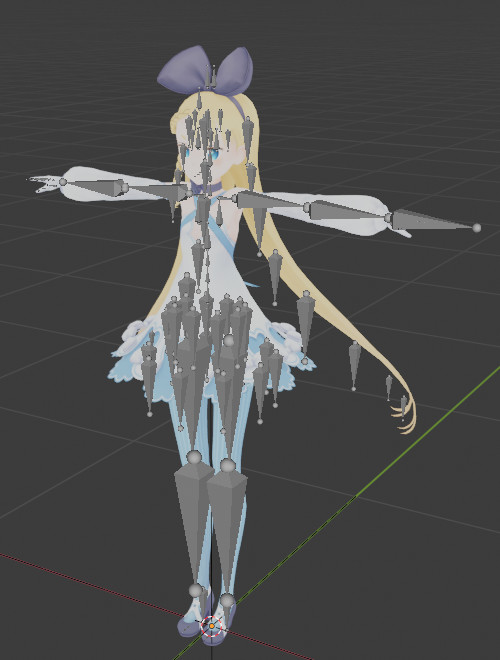
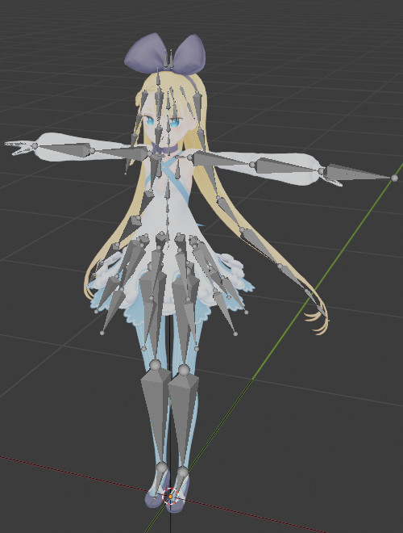
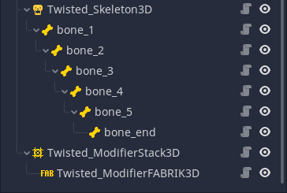

## Twisted IK 2 - How to Setup your Skeleton for IK

This page will describe and show how to setup your Skeleton for IK. This will cover considerations needed to be taken into account when exporting from a 3D creation software like Blender and how to setup the nodes for IK use in Godot.

Twisted IK 2 is designed to work with almost every skeleton and *should* work with the exports of almost every major 3D creation software out of the box. That said, there are some requirements and considerations to keep in mind, so without further ado, let's get started!

### Exporting from 3D creation software

#### Skeleton requirements

The biggest requirement by the Twisted IK 2 plugin is that bones in the 3D creation software HAVE to have bones with X, Y, or Z as the forward axis. I think every major 3D creation software enforces a bone forward direction on one of these axes, but on the off chance that this is not the case, I wanted to document this here. For Blender, the 3D creation software I use, this is handled automatically on export.

The second requirement is that bones most face each other if connected. For example, take a look at the following picture:

Look at the hair in particular. See how all the bones are facing down, not looking at each other? This is a problem, as Twisted IK 2 currently does not compensate for this, as the code to do so is complex and unwieldy (trust me on this one, I've done it and its a mess). So, you will need to fix this by making each of the bones face each other. Thankfully, in most 3D creation software, there are a couple ways to fix it:

* If this 3D file was imported into your 3D creation software, there may be an option to fix this. For example, in Blender with the default GLTF importer, you can have `bone direction` options and setting it to `Fortune` fixed the issue in this case without any additional work needed.
* If the above does not work or this is the original source file (I.E not imported), you can generally fix this issue by going into each bone and connecting them together. This should make the bones face their children, fixing the issue.

Once fixed, the bones should look something like this:

Again, look at the hair. Now the hair bones are facing the child bones correctly. With this fixed, the Skeleton will work just fine with Twisted IK 2.

#### Other skeleton notes

While not a strict requirement like the above, it is recommended to limit bone twisting along bone chains. For example, in the image above, the bones relative to their parent's are not twisted very much, if at all. Minimum twist is ideal for IK as then bending looks more natural.
Though, even bone twisting shouldn't be too much of an issue as almost every IK solver has additional bone rotation that can be applied, on all three axes (including twist), so you can get a result that looks natural for the bone setup you are using.

Another thing to note is that Twisted IK 2 works best with bones that are in a uniform, predictable rest position, like a T-pose or A-pose. If you have a skeleton with bones wrapped around each other, scaled funny, or otherwise just setup in a complex way, Twisted IK 2 may struggle to give visually appealing IK results. In these situations, I would recommend testing often in the 3D creation process to make sure the skeleton will function as you expect with IK.

#### FBX (.fbx) files

Another consideration, though not strict requirement per-say, is scale. This is especially an issue with FBX files, as generally their Skeletons are scaled by 100 or more. While Twisted IK 2 will likely work with these files, the incredibly small source scale of the FBX file may lead to precision issues as the Twisted_Bone3D files take the incredibly small scale of the source skeleton.

The easiest way to fix this is to export the FBX with a larger scale and/or import the Skeleton with a larger scale, depending on which works best. Personally, I have found that GLTF files are a tad more consistent with skeletons and bones, so if you can, you may want to use GLTF instead of FBX if you are getting issues with FBX files.

#### Collada (.dae) files

Collada files are fully supported and should work just fine. I have only done limited testing with Collada files with the plugin though, due to Godot's better Collada exporter not being supported official in Blender 2.8+, so its possible I have missed some issues.

If you find any issues with Collada files, please let me know!

#### GLTF (.glb) files

GLTF files are the most tested and recommend file format, as in my testing on the Twisted IK 2 plugin and in my work with the Google Summer of Code 2020 program, they had the least amount of issues. Twisted IK 2 should support all GLTF files without any issues, as long as the considerations above about bones are taken into account on export.

#### OBJ (.obj) files and skeletons made without bones

OBJ files do not support skeletons and bones, and therefor are currently not supported by Twisted IK 2, at least not without some workarounds. Likewise, skeletons made without the use of bones are also not supported.

However, it *may* be possible to work around this limitation by using Twisted_Bone3D nodes with a Twisted_Skeleton3D that is not bound to a Skeleton node in Godot. That said, this may lead to errors, has not been tested, and is (currently) not officially supported.

In the future, I may look into adding bone-less IK support, but this is currently not officially supported.

### Godot setup

The most basic IK setup for Twisted IK 2 is the following:

* Root Node Here
	* Skeleton3D
	* Twisted_Skeleton3D
		* Twisted_Bone3D (for each bone you want to animate)
			* Child Twisted_Bone3D (mirroring the bone structure of the Skeleton)
	* Twisted_ModifierStack3D
		* IK modifiers here!

Here's an image showing an example setup:

The Twisted IK 2 plugin only really has a couple major requirements on the Godot side:

* The Twisted_Bone3D nodes must be children of either a Twisted_Skeleton3D node or another Twisted_Bone3D node.
* Twisted_Bone3D nodes in the node tree should somewhat mirror the hierarchy of of the bones themselves. This will be mentioned in more detail later in this document under the "Twisted_Bone3D Godot hierarchy" section, which also has some optimization tips.

That is the minimum requirements for any of the IK to work. With the exception of the LookAt modifier, you need at *least* two Twisted_Bone3D nodes for optimal use. For IK modifiers like CurveIK or CCDIK, you probably want to have at least 3 bones, with CurveIK especially benefiting from additional bones.

All IK modifiers need to be a child node of a Twisted_ModifierStack3D node. IK modifiers are processed in order, from the first child to the last child. Here's an example showing what I mean:

* Twisted_ModifierStack3D
	* Twisted_ModifierFABRIK (will be processed first!)
	* Twisted_ModifierLookAt
	* Twisted_ModifierFABRIK (will be processed last!)

If you are using Twisted IK 2 for full body IK, then the order of the IK modifiers will be important. For example, you will want the IK modifier you are using for the spine to be *before* the IK modifier for the arms and head, as otherwise the IK calculations for the arms and head will be out of sync with the spine, making the IK results less visually appealing. Ideally, whenever possible it is best to have IK modifiers that affect other IK modifiers execute first, and then have the IK modifiers affected execute after that.

One last thing to mention about setup is that the Twisted_Bone3D nodes have a length property. Several IK modifiers need to know how long each bone is in order to work, and it uses the length property in the bone as the length of the bone itself.

By default this is automatically calculated for you and so long as the Twisted_Bone3D has a child Twisted_Bone3D node, this automatic calculation should work just fine without any adjustment needed.
However, this does not work for tip bones, or in other words, Twisted_Bone3D nodes without children Twisted_Bone3D nodes. For these nodes you have two options:

* Disable automatic length calculation (in the node inspector) and enter the length of the bone manually. The length of the bone is relative to the scale of the skeleton itself, which may (and likely does) differ from the Godot units.
* Add a Twisted_Bone3D node as a child of the tip node and call it something like "Bone_Tip" or similar, so you know what is used for. On this new node, set the bone ID to `-1` and disable automatic length calculation (optionally set it to something like `0.01`). Then position this node to the end of the bone in the Godot editor, save, and reload the scene. The tip bone will automatically calculate its length (assuming its enabled) and it should be good to go.

That's pretty much all the requirements. From here, you can add the Twisted_Modifier3D nodes you want to use, set them up, and then it should work! If you are curious to know more about an individual modifier, please look at the documentation and there should be a page for it!

Below are some notes about the Twisted_Bone3D hierarchy needed in Godot and some possible optimizations you can make.

#### Twisted_Bone3D Godot hierarchy

Let's look at the example scene tree again:

As you can see, each bone is a child of its parent: bone_2 is a child of bone_1, so it will inherit the transform changes. This is an important part of the Twisted IK 2 plugin, as it simplifies the node-to-bone process and makes algorithms like CCDIK work as expected (something that requires workarounds for other non-bone-based IK solutions). This is a soft requirement of the plugin: Twisted_Bone3D nodes should always be structured in a way so that they mirror the parent-child relationship of the actual skeleton.

However, what if you have more bones? Say you have a 3D humanoid character with bones for the head, neck, arms, body, and legs. This is a lot of bones, and this may not be desired if you are only wanting to apply IK to just the arms, for example. You may be thinking you need to structure everything up with the correct parent-child relations. This could lead to a TON of nodes, for example you might have a structure like this:

* Spine_Bone
	* Neck_Bone
		* Head_Bone
			* Eye_Left_Bone
			* Eye_Right_Bone
	* Upperarm_Bone_Left
		* Lowerarm_Bone_Left
	* Upperarm_Bone_Right
		* Lowerarm_Bone_Right

And so on. Let's say you just want to move the head and eyes. You may think you need to include the spine bone, but this actually is not the case! You can optimize your Twisted_Bone3D node setup by having only the shared parent Twisted_Bone3D node in the scene and setting it to **only follow** the bone.

For the example above, you could reduce the scene tree to the following:

* Neck_Bone (set to only follow)
	* Head_Bone
		* Eye_Left_Bone
		* Eye_Right_Bone

As you can see, you can skip the Spine bone! The requirement for optimal IK results is that there needs to be a root Twisted_Bone3D that is set to only follow, but this bone does not need to be the root of the skeleton itself. This helps reduce the amount of bones needed, as you can only add the bones you need.

For example, this can also be used for things like TwoBoneIK if you want to use it for bone chains that have more than 2 bones. Check out `3D_Test_Scene_5.tscn` for an example of TwoBoneIK being used on a bone chain that has 5 bones, making TwoBoneIK applied across all 5 bones instead of 2.

(*Note: This may be a bit confusing. In the future, I plan to make a better example project showing a good optimal Twisted_Bone3D setup.*)

